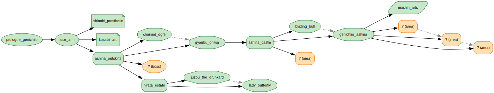
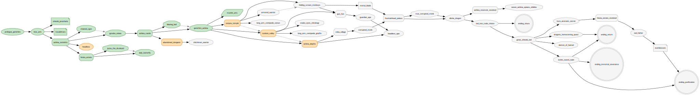

# GameBuddy

> Spoiler-safe session recall for singleplayer games.

A personal tool for resuming singleplayer games after long breaks. Reads save
files where it can, lets you annotate where it can't, and produces a
re-immersion briefing that respects how far you've actually progressed — no
plot reveals you didn't ask for.

## See it in action

**[Live demo →](https://priyansh-shukla.github.io/Gamebuddy/demo/)**

Visual walkthrough of v1 against Sekiro: progression-DAG maps, Ship-Log-style
journals, the structural spoiler filter in action across three player-state
checkpoints, and a mocked synthesis briefing. The headline shot:

| Player view — masked | Authoring view — reveal |
| :---: | :---: |
|  |  |
| 14 observed, 5 frontier (`? (type)` stubs), 30 gated nodes invisible | All 49 nodes — endings, late-game bosses, branching paths |

Same code, same data, one boolean. The model that synthesizes a briefing
**literally never receives** the gated nodes — the filter happens at
prompt-build time, not by asking the model nicely.

## How it works

- **Two knowledge stores.** Game context (wiki-sourced MD files) ships with
  the app. Player state (save-derived observations) stays on your machine.
- **Providers** turn signals into normalized observations: save-file parsing
  (preferred), screenshot/OCR (later), manual notes.
- **Synthesis** is a single Anthropic API call — no agentic loops at recall
  time, because any tool that fetches external content is a spoiler vector.
- **Progression is a DAG** per game. Each piece of game context declares
  which nodes gate it; the synthesis prompt is filtered by `gates ⊆ observed`
  before the model ever sees it. The spoiler boundary is enforced
  structurally, not by prompt instructions.
- **CLI-first, on-demand.** No daemon.

Full design in [DESIGN.md](DESIGN.md). Per-file demo guide in [demo/README.md](demo/README.md).

## Status

**v1 framework complete; one human-loop task remains.** Save-format crypto,
synthesis layer, structural filter, CLI, and visualization all working. The
remaining v1 task is field-offset discovery in Sekiro `.sl2` slot bodies —
which bytes correspond to sen / prayer beads / gourd seeds / etc. — done
by save-diff with the developer at the controls.

## Roadmap

- **v1 — Sekiro.** Save parser, game-context files, synthesis, CLI end-to-end.
  Developer's own playthrough is the test set.
- **v2 — Subnautica.** Blind-playthrough test of the spoiler model under real
  stakes.
- **v3+** — Generalize. Candidate: Cyberpunk 2077.

## Why this exists

Personal tool. I play several singleplayer games in parallel and lose context
during work/life breaks. Logging manually doesn't survive contact with my own
discipline; reading the save file does.
